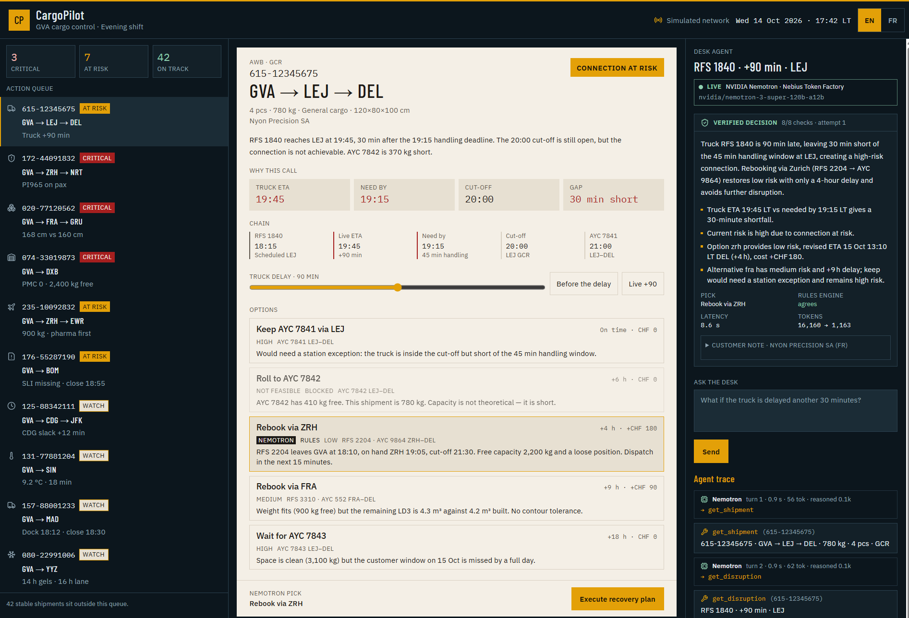

# CargoPilot

**Air-cargo shipments miss their flights for reasons that are visible hours before: a late truck, a cut-off, a hold with kilos but no pallet position. CargoPilot puts NVIDIA Nemotron on the night desk to work each file the way a duty officer would, and a verifier rejects any recommendation whose times, kilos or flights don't match the data.**

Built for the Nebius × NVIDIA Global AI Hackathon, **Best Apps & Agents** track.

- **Live demo:** _add the deployment URL here_
- **Video (≤ 3 min):** _add the link here_
- **Check it in one command, no key needed:** `npm ci && npm run judge-demo`



## What it does

A Geneva (GVA) export desk at 17:42. The queue holds 10 files that are going wrong in 10 different ways. Each one is a failure mode a cargo team actually sees:

| File | What breaks |
| --- | --- |
| 615-12345675 GVA→LEJ→DEL | Road feeder truck +90 min: it reaches LEJ inside the cut-off but past the 45 min handling window, and the next LEJ flight has 410 kg for 780 kg |
| 172-44091832 GVA→NRT | UN3480 PI965 lithium batteries booked on a passenger aircraft |
| 020-77120562 GVA→GRU | 960 kg is fine, but one piece is 168 cm against a 160 cm belly hold |
| 074-33019873 GVA→DXB | 2,400 kg free on the flight, but no PMC position left |
| 235-10092832 GVA→EWR | Last pallet: textiles vs must-ride pharma |
| 176-55287190 GVA→BOM | Freight on hand, SLI missing, acceptance closes 18:55 |
| 125-88342111 GVA→CDG→JFK | Minimum connection time at CDG getting thin |
| 131-77881204 GVA→SIN | Pharma probe at 9.2 °C: watch, or excursion? |
| 157-88001233 GVA→MAD | Perishables racing the acceptance close |
| 080-22991006 GVA→YYZ | Gel packs qualified for 14 h on a 16 h lane |

Open a file and the agent works it: it calls tools for the facts, ranks the recovery options, explains the call with the exact figures, and drafts the customer note in the customer's language. The duty officer can drag the truck delay, flip "what if" toggles, or type a question in **English or French** ("Le camion est en retard de 45 minutes. Qu'est-ce qu'on fait ?"). **Execute recovery plan** stages the rebooking request, the customer message and the handling instruction. Nothing is transmitted to a carrier.

## How it uses NVIDIA Nemotron on Nebius Token Factory

```
 Duty officer ──► /api/agent (server, holds the key)
                     │
                     ▼
     ┌──────── NVIDIA Nemotron 3 Super ─────────┐   Nebius Token Factory
     │  OpenAI-compatible chat/completions       │   tools + tool_choice:auto
     │  picks tools · reads facts · ranks · writes
     └──────┬──────────────────────────▲─────────┘
            │ tool calls               │ tool results / verifier feedback
            ▼                          │
   get_shipment  get_disruption  get_cutoffs  check_connection
   get_capacity  check_restrictions  calculate_risk  find_alternatives
            │        (deterministic cargo rules — facts only)
            ▼
   submit_decision ──► VERIFIER ──► accepted ──► UI (streamed step by step)
                          │
                          └─ rejected → failures returned to Nemotron (max 3)
                                        → then rules-engine decision, labelled
```

- **Model:** `nvidia/nemotron-3-super-120b-a12b` (configurable with `NEBIUS_MODEL`) at `https://api.tokenfactory.nebius.com/v1`, through native function calling.
- **Nemotron drives the loop.** It decides which of the 8 tools to call and in what order, reads the outputs, ranks the options and calls `submit_decision`. The tools return facts only. The rules engine's own recommendation is never sent to the model, and a test enforces that.
- **The model proposes, the verifier checks** (`src/lib/agent/verifier.ts`). A decision is sent back to the model if:
  - it recommends or ranks an option that breaks a hard constraint (DG on a passenger aircraft, a piece over the height limit, capacity short);
  - its risk class differs from `calculate_risk`;
  - any time, kg, min, cm, °C or m³ figure can't be found in this run's tool outputs, or derived as the difference of two of them ("370 kg short" = 780 − 410). Hours of delay and CHF costs must be quoted exactly;
  - it cites a probability that no tool produced;
  - it names a flight, truck, AWB, UN or PI number that no tool returned;
  - it answers the operator in the wrong language, or the customer note misses the AWB or is in the wrong language.

  The failures go back to Nemotron as the tool result, and it gets three submissions.
- **The whole run is visible.** Each model turn (latency, tokens, length of reasoning), each tool call with its raw output, and each verifier pass streams into the agent panel. The UI also shows whether the rules engine would have picked the same option.

### Three modes, always labelled

| Mode | When | Badge |
| --- | --- | --- |
| **Live** | `NEBIUS_API_KEY` is set | `LIVE · NVIDIA Nemotron · Nebius Token Factory` |
| **Replay** | No key, but this exact scenario was recorded with `npm run agent:record` | `REPLAY · recorded <timestamp> · <model>` |
| **Rules only** | No key and no recording, or the "Rules engine only" toggle is on | `RULES ONLY · no model call` |

A replay is served unchanged from the recorded run. `npm run judge-demo` re-verifies every recorded trace against freshly computed tool outputs, so an edited trace or an engine change after recording fails the check.

## Run it

```bash
npm ci
npm run judge-demo      # < 5 s, no key: tests + AWB check + 244 scenarios through the verifier + recorded traces re-verified
npm run dev             # http://localhost:8080 (rules/replay mode without a key)
```

With a Nebius key:

```bash
cp .env.example .env    # set NEBIUS_API_KEY
npm run agent:models    # lists the Nemotron ids your key can call; checks NEBIUS_MODEL
npm run dev             # agent panel now shows LIVE
npm run agent:record    # runs Nemotron on the 30-scenario eval set → data/traces/ + data/eval/report.md
```

Deploy: `npm run build` produces Vercel output (Node 22 function, response streaming, 120 s max). Set `NEBIUS_API_KEY` in the project environment. `AGENT_RATE_PER_10MIN` and `AGENT_MAX_LIVE_PER_HOUR` cap spend per instance, and identical scenarios are cached for 30 minutes.

## Evaluation

`npm run agent:record` runs Nemotron live on 30 scenarios: every file, each "what if" toggle, the delay sweep on the hero file, both languages, and the exact operator turns used in the demo. It writes [`data/eval/report.md`](data/eval/report.md) from the recorded runs; nothing in it is typed by hand. Each new recording archives the previous one in [`data/eval/history/`](data/eval/history/), and `npm run judge-demo` re-verifies all of them.

**Three prompt versions, same model (`nvidia/nemotron-3-super-120b-a12b`), same 30 scenarios, 4 Oct 2026:**

| | prompt v1 | prompt v2 | prompt v3 (current) |
| --- | --- | --- | --- |
| Accepted by the verifier on first submission | 27/30 | 28/30 | **30/30** |
| Accepted after verifier feedback | 30/30 | 30/30 | 30/30 |
| Fell back to the rules engine | 0 | 0 | 0 |
| Verified pick = rules-engine pick | 27/30 | 26/30 | **29/30** |
| Latency p50 / p95 | 8.3 / 12.7 s | 9.1 / 14.3 s | 10.4 / 12.5 s |
| Cost for 30 runs at list price | $0.18 | $0.18 | $0.20 |

**What the verifier caught, and what each prompt change fixed.** Every row is real Nemotron output from the archived runs:

| Run | What Nemotron submitted | Checks that sent it back | Fixed in |
| --- | --- | --- | --- |
| v1 · truck +120 min | An option's risk label ("Low") as the file's risk class | `schema` | v2: the risk class is the file's own |
| v1 · "What if the truck is delayed another 30 minutes?" | A decision without calling `find_alternatives`: recommended "None", no answer to the operator | `tools`, `option`, `reply` | v2: the workflow is required on operator turns |
| v1 · "Why this call?" | The same shortcut, with a malformed ranking and no reply | `tools`, `ranking`, `reply` | v2 |
| v2 · both English operator turns on the French customer's file | A reply in French: it followed the customer's language, not the operator's | `reply` | v3: the reply is always in the operator's language |

Every rejected decision was corrected on Nemotron's second submission. v1 → v2 removed the workflow shortcut; v2 → v3 removed the language slip. To watch those catches in the app, open it with `?replay=v1` or `?replay=v2`: the archived run is replayed and labelled with its prompt version.

**The policy change in v3.** In v1 and v2, Nemotron rerouted shipments whose booked connection was tight but still achievable (Medium risk, 0–15 min of slack), costing +4–6 h and CHF 150–180. The rules engine kept the booking. v3 encodes the desk's policy: keep the booking and state the exact trigger that would force a reroute (for example "reroute if the truck ETA passes 19:15"). Agreement with the rules engine went from 26/30 to 29/30.

**The remaining disagreement** (both picks pass every hard constraint): with the tall piece dropped, Nemotron takes the main deck (Low risk, CHF 340) over the engine's split shipment (Medium risk, CHF 210). That follows its risk-before-cost ranking for alternatives.

## Real vs simulated

| Element | Status |
| --- | --- |
| NVIDIA Nemotron calls on Nebius Token Factory (live mode) | **Real** |
| Tool-calling loop, verifier, rejection and retry, fallback | **Real**, running code covered by tests |
| Recorded replays in `data/traces/` | **Real** model output, recorded with `npm run agent:record` (model id and timestamp in each file) |
| IATA AWB check digit (serial mod 7) | **Real** rule; every AWB in the network passes it |
| UN3480 PI965 lithium-ion batteries forbidden on passenger aircraft | **Real** IATA DGR rule |
| +2/+8 °C pharma range | **Real** industry standard |
| Airports (GVA, LEJ, ZRH, FRA, CDG, …) | Real codes |
| Flights `AYC xxx`, trucks `RFS xxxx`, schedules, free capacity | **Simulated** |
| Customers (Nyon Precision SA, Helvetia Cell AG, …) | **Simulated**: invented names. Any match with a real company is coincidental |
| AWB numbers | **Simulated**. The 3-digit prefixes follow the IATA format and may coincide with real airline prefixes; they don't imply that airline is involved |
| 45 min LEJ handling window, 50 min CDG minimum connection, acceptance closes, 160 cm belly limit, 300 cm main-deck door, 1,100 kg half-pallet limit, 14 h gel qualification, 30 min / 10 °C excursion rule, costs in CHF | **Simulated** values chosen to be plausible, not taken from any carrier, handler or shipper |
| Rebooking requests, customer emails, handling instructions | **Generated**, never transmitted |

## Honest limits

- **The verifier checks grounding, not judgement.** A decision can quote every figure correctly and still choose a worse option. One example: keeping a connection that depends on a station accepting a late tender, when a low-risk reroute exists. The prompt tells Nemotron to rank by risk before delay, and the UI shows the rules engine's pick next to Nemotron's so a disagreement is visible, not hidden.
- **The "derived figure" rule is deliberately narrow, but not airtight.** For kg, minutes, cm, m³ and °C, a difference of two quoted figures passes ("370 kg short" = 780 − 410). A wrong number can occasionally slip through if it happens to equal such a difference. Hours of delay and CHF costs get no such allowance and must be quoted exactly.
- **The language check is a word-count heuristic.** It catches a reply in the wrong language, not bad grammar.
- **The cargo network is 10 hand-built files.** It is not a solver over a real schedule. The point is the agent pattern: tools return facts, the model decides, a verifier gates. That transfers to a real TMS or airline API behind the same tool interface.

## Project layout

```
src/lib/cargo/engine.ts     simulated network + deterministic cargo rules (10 failure modes)
src/lib/agent/tools.ts      8 tools + submit_decision schema; facts only
src/lib/agent/agent.ts      live Nemotron loop, rules agent, replay
src/lib/agent/verifier.ts   grounding + constraint checks
src/lib/agent/server.ts     /api/agent: mode selection, spend limits, NDJSON streaming
src/lib/agent/matrix.ts     eval scenarios + operator-message handling shared with the UI
src/components/tower/       queue · shipment file · agent panel
scripts/agent-cli.ts        judge-demo · agent:models · agent:record · agent:eval
tests/agent.test.ts         verifier, AWB, live loop against a scripted responder
```

## License

MIT
